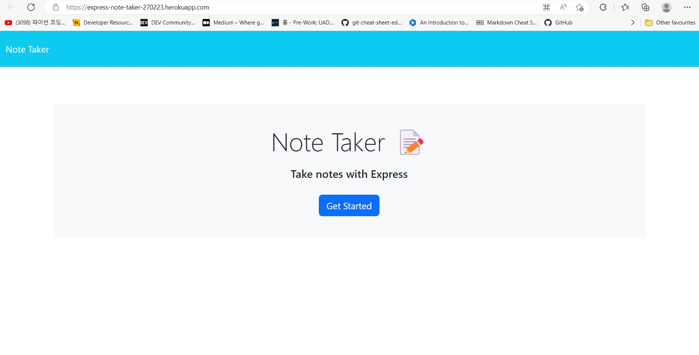
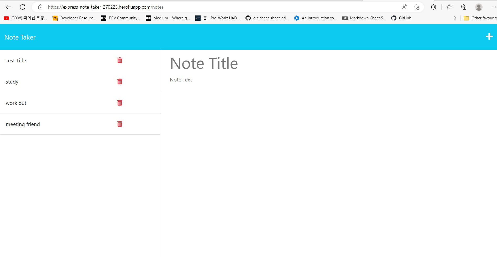

# Express-Note-Taker

## Description

This project was created to create an application for Note taker that can be used to write and save notes. It contains notes on HTML, CSS and express.js.

I created a Note taker with using the express mobule in npm package that meets certain criteria.

This app runs in the terminal and features dynamically updated HTML and CSS powered by express.js code.

I learned how to get data from data base and post data to data base, save the requested data into data base and deploy the entire application to Heroku.

Also I learned how to synchronize between front-end and back-end with express.js
 

## Installation

N/A  

## Usage

To understand the code that I code, please read the comments in code.

When User opens the Note Taker, the user will be presented with a landing page with a link to a notes page.

When User clicks on the link to the notes page, the user will be presented with a page with existing notes listed in the left-hand column, plus empty fields to enter a new note title and the note’s text in the right-hand column.

When User enters a new note title and the note’s text, a Save icon will be appear in the navigation at the top of the page.

When User clicks on the Save icon, the new note the user have entered will be saved and appears in the left-hand column with the other existing notes.

When User clicks on an existing note in the list in the left-hand column, that note will be appeared in the right-hand column.

When User clicks on the Write icon in the navigation at the top of the page, the user will be presented with empty fields to enter a new note title and the note’s text in the right-hand column.
 

How to operate : Please type "npm start" in teminal  

 
 

(screenshot image could be slitely different with the web application)

## Credits

N/A

## License

N/A